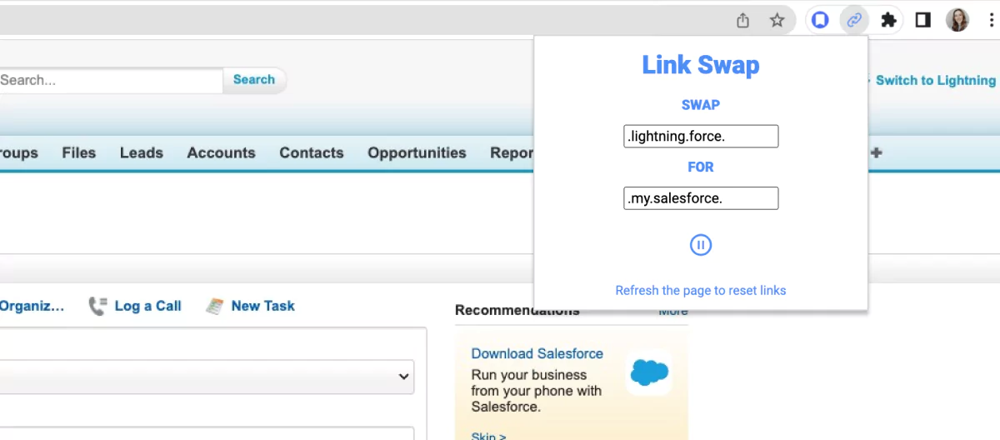

# link-swap-extension

**Note:** As of 4/24 this isn't working perfectly - working on a fix then publishing to the chrome store. 

I originally built this extension to satisfy a request my husband had for a fix to his own workflow - to swap a small part of the Salesforce links he had to use for work that directed him to Salesforce's new UI, with a string that would then make the link direct him to the old UI, which he preferred. I recently updated the app to be a more multi-purpose tool where the user can input any string they want to find, and any string they want to replace it with, and the extension will find any instances of links that contain the original string and swap it for the new one. I plan on publishing it to the Chrome Store soon!

